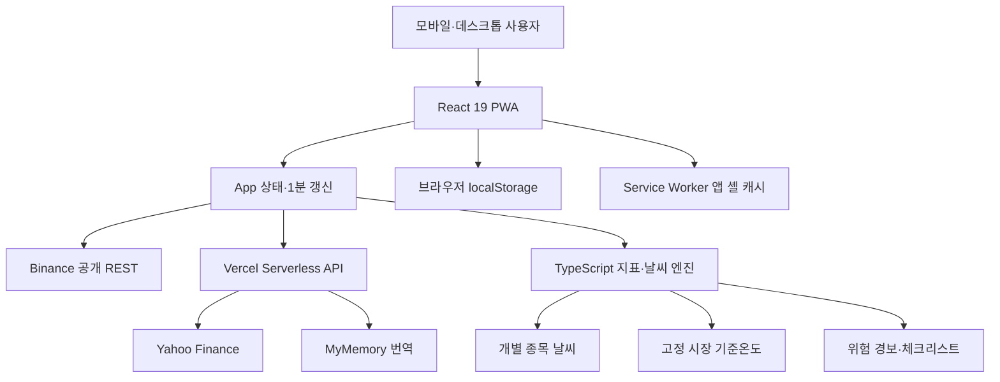

# 시장기상청 제품·기술 컨텍스트 문서

> 작성 기준일: 2026-06-19  
> 저장소: https://github.com/KNOKSS/market-weathercast  
> 서비스: https://market-weathercast.vercel.app/  
> 목적: 다른 GPT가 현재 앱의 제품 철학, 구현 상태, 데이터 구조, 계산 방식과 한계를 정확히 이해하고 향후 방향을 논의할 수 있게 하는 기준 문서

---

## 1. 한 문장 정의

**시장기상청은 주식·지수·가상자산의 가격, 추세, 모멘텀, 변동성, 거래량을 분석해 복잡한 시장 상태를 `맑음·흐림·소나기·태풍경보` 같은 날씨 언어로 번역하는 모바일 우선 PWA 시장 관측 도구다.**

자동매매, 주문 실행, 종목 추천을 하는 앱이 아니다. 사용자가 매매 전에 시장 환경과 위험 수준을 빠르게 파악하고, 충동적인 결정을 줄이도록 돕는 것이 목적이다.

## 2. 해결하려는 문제

일반 투자 앱은 숫자와 차트가 많지만, 초보자나 모바일 사용자가 짧은 시간 안에 다음을 파악하기 어렵다.

- 지금 시장이 위험선호인지 위험회피인지
- 추세가 상승해도 변동성과 과열 위험이 얼마나 큰지
- 현재 움직임이 하루짜리 잡음인지 5일·20일 흐름과 같은 방향인지
- 미국 주식, 변동성, 비트코인 등 서로 다른 시장이 같은 방향을 보는지
- 진입 전에 손절가, 목표가, 레버리지와 손익비를 제대로 점검했는지

시장기상청은 이를 실제 기상예보처럼 단순화한다. 다만 단순화 과정에서 원래 숫자를 숨기지 않고, 사용자가 원하면 점수의 구성 요소와 원자료를 다시 확인할 수 있게 한다.

## 3. 핵심 제품 원칙

1. **날씨는 설명 방식이지 예언이 아니다.** 미래 가격을 맞히는 예측 모델이 아니라 현재 시장 환경을 요약하는 휴리스틱이다.
2. **전체 시장과 개별 종목을 분리한다.** 사용자가 TSLA 같은 종목을 추가해도 전체 시장 기준온도는 바뀌지 않는다.
3. **현재가 등락은 올바른 기준과 비교한다.** 주식·지수는 전일 종가, 가상자산은 24시간 기준 등락을 사용한다.
4. **원인을 확인할 수 있어야 한다.** 시장 체감온도는 추세, 모멘텀, 변동성, 거래활력, 과열·방향충돌 보정으로 분해해 표시한다.
5. **데이터 장애가 앱 전체를 깨뜨리지 않아야 한다.** 외부 API가 실패하면 샘플 데이터로 전환하고 상태와 낮은 산출 신뢰도를 표시한다.
6. **모바일에서 한 손으로 사용 가능해야 한다.** 하단 탭, 세로형 카드, 안전영역 대응, PWA 설치를 기본으로 한다.
7. **투자 조언처럼 말하지 않는다.** 위험을 설명하고 체크리스트를 제공하지만 매수·매도 결정을 대신하지 않는다.

## 4. 현재 화면 구조

앱의 주 내비게이션은 네 개다.

### 4.1 글로벌 상황실

시장 전체를 넓게 보는 뉴스룸형 대시보드다.

- 서울, 도쿄, 런던, 뉴욕의 현지 시각과 장전·거래 중·마감 상태
- 고정 시장 바스켓으로 계산한 `전체 시장 기준온도`
- S&P 500, NASDAQ, VIX, BTC, 달러 흐름을 이용한 짧은 상황 브리핑
- S&P 500, NASDAQ, VIX, KOSPI, Nikkei 225, Euro Stoxx 50 등 주요 지수
- 미국 10년물, 달러 인덱스, 원·달러, 금, WTI, 비트코인 등 교차자산 현황
- 사용자가 Yahoo 검색으로 관심 지표를 추가·삭제하고 순서를 변경하는 상황판 편집 기능

세계 시장 시계는 정규장 시간과 평일 여부를 단순 계산한다. 거래소 휴일 캘린더까지 반영하는 구조는 아직 아니다.

### 4.2 시장날씨

선택한 한 종목을 깊게 읽는 핵심 화면이다. 현재 순서는 다음과 같이 단순화되어 있다.

1. 선택 종목의 오늘 날씨와 관측소 정체성
2. 시장 체감온도와 강수위험
3. 기압·추세, 습도·모멘텀, 바람·변동성 안정, 시야·거래활력
4. 선택한 지표가 점수에 준 기여도와 원자료 설명
5. 최근 5일 또는 오늘 장중 차트
6. 현재가, 전일/24시간 등락, 날씨, 강수확률
7. 개별 관측소 카드 목록

아래의 종목 카드를 누르면 선택 상태가 즉시 표시되고 상단 관측소가 바뀌며, 화면이 최상단 날씨 카드로 부드럽게 이동한다.

`관측소 관리`에서는 다음이 가능하다.

- Yahoo Finance 검색을 통한 미국 주식·ETF·지수 추가
- 기본 관측소를 포함한 모든 표시 종목 삭제
- 표시 종목이 0개일 때 빈 상태 안내와 기본 관측소 복원
- 사용자가 만든 목록을 브라우저에 저장

기본 표시 관측소는 BTC, ETH, SOL, S&P 500, NASDAQ이다. 이 표시 목록을 삭제해도 전체 시장 기준온도 계산에 필요한 고정 바스켓은 백그라운드에서 별도로 유지된다.

### 4.3 브리핑

데이터 브리핑, 뉴스, 위험 경보를 한 화면에 결합한 뉴스 데스크다.

- 전체 시장온도에 따른 오늘의 데이터 헤드라인
- 주식, 변동성, 가상자산, 종합 관측 문장
- 수집된 뉴스의 분야별 이슈 레이더
- Yahoo Finance 핵심 뉴스와 원문 링크
- 뉴스 자동 분류: 증시, 금리·연준, 기술·AI, 가상자산, 원자재, 글로벌
- 영어 제목의 한국어 자동 번역과 영어 원문 병기
- 알고리즘이 생성한 종목별 위험 주의보·경보

데이터 해설과 뉴스는 함께 보이지만, 앱은 뉴스가 가격 움직임의 원인이라고 단정하지 않는다.

### 4.4 체크

진입 전 매매 계획을 점검하는 계산기다.

- 롱/숏 방향
- 진입가, 손절가, 목표가
- 레버리지, 포지션 크기
- 손익비
- 예상 이익·손실과 레버리지 적용 결과
- 방향과 손절/목표 위치의 모순 검사
- 높은 레버리지, 낮은 손익비, 청산거리 접근 경고
- 선택 종목의 날씨, 강수위험, FOMO 자외선, 바람을 반영한 추가 경고

입력값은 브라우저에 저장된다. 주문을 전송하거나 거래소 계정과 연결하지 않는다.

## 5. 날씨 은유와 금융 지표의 대응

| 날씨 표현 | 금융 의미 | 주요 입력 |
|---|---|---|
| 시장 체감온도 | 종합적인 시장 우호도 | 추세, 모멘텀, 변동성 안정, 거래활력, 위험 보정 |
| 강수위험 | 급격한 흔들림과 신호 충돌 위험 | 단기 변동, 변동성, 거래량 부족, RSI 극단, 단기·중기 방향 충돌 |
| 기압·추세 | 가격 방향의 지속성 | 5일·20일 수익률, 5/20일 이동평균 차이, 장중 변화 |
| 습도·모멘텀 | 상승·하락 압력의 강도 | 일봉 우선 RSI와 장중 변화 |
| 바람·변동성 안정 | 가격 흔들림의 크기 | 단기 ATR, 일봉 ATR |
| 시야·거래활력 | 움직임을 지지하는 거래 참여 | 최근 거래량 / 20기간 평균 거래량 |
| 자외선 | 과열·FOMO 위험 | 높은 RSI, 단기 급등, 연속 양봉 |
| 미세먼지 | 거래량 기반 시야 품질 | 거래량 비율 |

날씨 등급은 아래 순서로 판정한다.

1. 강수위험 78% 이상 또는 바람이 `돌풍`이면 `태풍경보`
2. 강수위험 62% 이상 또는 바람이 `강함`이면 `소나기`
3. 그 외 체감온도 82 이상은 `쾌청`
4. 66 이상은 `맑음`
5. 48 이상은 `구름 조금`
6. 나머지는 `흐림`

따라서 온도가 높더라도 변동성과 충돌 위험이 크면 소나기나 태풍경보가 먼저 적용된다.

## 6. 개별 종목 점수 계산 방식

계산은 서버의 AI 모델이 아니라 브라우저의 TypeScript 규칙 엔진에서 수행한다.

### 6.1 사용 지표

- RSI 14
- ATR 유사 True Range의 종가 대비 비율
- 20기간 평균 대비 현재 거래량 비율
- 최근 4개·24개 분봉 변화
- 최근 5일·20일 변화
- 5일·20일 단순이동평균 차이
- 최근 연속 양봉 수

### 6.2 체감온도 구성

중립값 50에서 각 요소의 기여도를 더하고 위험 패널티를 뺀 뒤 0~100으로 제한한다.

- 추세: 35%
- 모멘텀: 20%
- 변동성 안정: 20%
- 거래활력: 15%
- 과열 및 단기·중기 방향충돌: 감점 항목

추세 점수는 5일, 20일, 이동평균 간격, 장중 흐름을 함께 본다. 모멘텀은 가능한 경우 일봉 RSI를 우선 사용한다. 변동성 안정 목표치는 가상자산과 주식·지수에 다르게 설정되어 있다. 거래활력은 거래량 비율을 로그 스케일로 반영한다.

### 6.3 강수위험

기본 위험 22에서 다음 조건에 따라 증가한다.

- 변동성 안정 점수가 낮음
- 짧은 구간 가격 변화가 큼
- 장중 방향과 5일 방향이 충돌
- 거래활력이 지나치게 낮음
- RSI가 과매수·과매도 극단 구간

### 6.4 산출 신뢰도

- 샘플 데이터: 35%
- 실데이터: 기본 55%
- 분봉 60개 이상: +15%
- 일봉 20개 이상: +25%
- 전일/24시간 등락 확보: +5%

신뢰도는 데이터 충실도를 나타내며, 점수 자체가 미래를 맞힐 확률이라는 뜻이 아니다.

## 7. 전체 시장 기준온도

전체 시장온도는 사용자의 관측소 목록과 완전히 분리된 고정 바스켓으로 계산한다.

| 구성 자산 | 비중 | 역할 |
|---|---:|---|
| S&P 500 | 35% | 미국 대형주 전반의 위험선호 |
| NASDAQ | 30% | 성장주·기술주 위험선호 |
| VIX | 20% | 시장 긴장과 변동성 위험의 역방향 보정 |
| BTC | 15% | 24시간 고위험 자산 심리 |

VIX는 일반 종목 온도를 그대로 사용하지 않는다.

- VIX 안정 점수: `100 - max(0, VIX - 12) × 4.2`
- VIX 강수위험: `15 + max(0, VIX - 12) × 5`

일부 데이터만 들어온 경우 이용 가능한 자산의 비중을 다시 정규화해 임시 점수를 만든다. 사용자 추가 종목과 표시 목록은 이 계산에 영향을 주지 않는다.

## 8. 5일 일기예보형 차트

기존의 맥락 없는 선 차트를 보완하기 위해 최근 5일 또는 5거래일을 일기예보 카드처럼 표시한다.

- 날짜와 요일
- 일간 등락률
- 일중 고저폭
- 등락과 고저폭에 따른 하루 날씨 아이콘
- 최근 관측 표시
- 5일 누적 등락
- 상승일·하락일 수
- 5일 추세: 상승, 하락, 보합

가상자산 날짜는 서울 시간, 주식·지수는 뉴욕 시간을 기준으로 표시한다.

## 9. 데이터 소스와 수집 방식

### 9.1 Binance

대상: BTCUSDT, ETHUSDT, SOLUSDT

- 최근 96개의 1분봉
- 최근 30개의 일봉
- 24시간 티커 등락률
- 브라우저에서 Binance 공개 REST API에 직접 요청

### 9.2 Yahoo Finance

대상: 미국 지수, VIX, 사용자 추가 주식·ETF·지수, 세계 지수, 금리, 환율, 원자재, 뉴스

- 차트: Vercel `/api/yahoo` 프록시
- 종목 검색: `/api/search`
- 뉴스: `/api/news`
- 주식·지수 등락률: 현재가와 Yahoo 메타데이터의 전일 종가 비교
- 시장날씨: 최근 5일 1분 데이터 중 최근 96개와 최근 1개월 일봉
- 상황실 카드: 최근 1개월 일봉 중 최근 6개

Yahoo Finance는 공식 유료 계약형 데이터 SDK가 아니라 공개 엔드포인트를 프록시하는 구조다. 제공처 정책, 호출 제한, 거래소별 지연에 영향을 받을 수 있다.

### 9.3 번역

- MyMemory 번역 서비스의 영어→한국어 번역
- Vercel `/api/translate` 프록시
- 뉴스 상위 12개를 4개씩 나누어 처리
- 번역 품질 검사 후 한국어가 실제로 포함된 결과만 사용
- 최근 번역 최대 80개를 브라우저에 저장

### 9.4 장애 대응

시장 데이터 호출이 실패하거나 캔들 수가 부족하면 결정론적으로 생성한 샘플 캔들로 대체한다. UI에는 `샘플 데이터`와 낮은 신뢰도를 표시한다. 뉴스나 번역이 실패하면 시장 데이터 브리핑은 유지하고 뉴스 영역만 재시도 상태로 전환한다.

## 10. 갱신 주기와 “실시간”의 의미

- 핵심 관측소 데이터: 60초 자동 재요청
- 수동 새로고침 버튼: 즉시 재요청
- 앱이 백그라운드에서 다시 보이는 순간: 재요청
- 네트워크가 오프라인에서 온라인으로 돌아오는 순간: 재요청
- 상황실의 세계 지수·교차자산: 5분 갱신
- 뉴스 클라이언트 캐시: 5분
- 뉴스 서버 캐시: 5분, stale-while-revalidate 15분
- 검색 서버 캐시: 2분, stale-while-revalidate 10분
- 번역 서버 캐시: 1일, stale-while-revalidate 7일

여기서 `실시간`은 스트리밍 WebSocket이 아니라 1분 주기의 폴링과 최신 1분봉을 의미한다. Binance는 비교적 빠르지만 Yahoo 데이터는 거래소와 제공처 사정에 따라 지연될 수 있다.

## 11. 뉴스와 자동 브리핑

Yahoo Finance에서 `^GSPC`, `^IXIC`, `^TNX`, `Ethereum`을 각각 검색해 헤드라인을 모으고 중복을 제거한 뒤 최신 16개를 사용한다.

제목과 관련 티커의 키워드로 분야를 분류한다. 현재 수집 단계에서는 분류 결과가 `글로벌`뿐인 일반 기사는 제외될 수 있다. 데이터 브리핑은 뉴스 내용을 요약하는 생성형 AI가 아니라 다음 규칙으로 작성된다.

- S&P 500과 NASDAQ 평균 등락으로 미국 주식 강세·약세·혼조 판단
- VIX 수준으로 안정·주의·경계 판단
- BTC 24시간 등락으로 고위험 자산 선호 판단
- 전체 시장 체감온도와 강수위험을 종합 문장으로 표시

즉, 현재 앱의 브리핑은 재현 가능한 규칙 기반 해설이다. 뉴스의 의미 분석, 이벤트 인과관계 추론, 컨센서스 요약은 아직 구현되지 않았다.

## 12. 위험 경보와 체크리스트

위험 경보는 종목별 날씨 점수에서 강수위험, 바람, 자외선, 낮은 체감온도 등의 조건을 감지해 안내·주의보·경보 문구를 만든다.

체크리스트는 입력된 매매 계획을 수학적으로 검사한다.

- 롱은 손절가가 진입가 아래, 목표가가 진입가 위인지 확인
- 숏은 반대로 확인
- 손익비 1.5 미만 경고
- 레버리지 5배 이상 및 10배 이상 단계별 경고
- 손절 폭과 단순 예상 청산거리 `100 / 레버리지` 비교
- 포지션 크기가 있으면 예상 금액 손익 계산
- 선택 종목이 태풍경보, 높은 강수위험, 높은 자외선, 강풍일 때 추가 경고

이 계산은 거래소별 유지증거금, 수수료, 펀딩비, 실제 청산 공식을 반영한 정밀 청산 계산기는 아니다.

## 13. 기술 아키텍처



### 프런트엔드

- React 19
- TypeScript 5.9
- Vite 7
- 외부 UI 프레임워크 없이 React 컴포넌트와 단일 CSS 디자인 시스템 사용
- SVG·CSS 기반 날씨 아이콘과 애니메이션
- 클라이언트 측 지표 계산

### 서버

- 별도 상시 서버나 데이터베이스 없음
- Vercel의 `api/*.js` 서버리스 함수 네 개
- Yahoo 차트, 검색, 뉴스, MyMemory 번역을 위한 경량 프록시
- 현재 환경변수와 API 키 없음

### 배포

- GitHub `main` 브랜치와 Vercel 연결
- `pnpm install --frozen-lockfile`
- `pnpm run build`
- 결과물 `dist`
- Node.js 22 이상 25 미만

## 14. PWA와 모바일 UX

- `manifest.webmanifest`를 통한 홈 화면 설치
- standalone, portrait 설정
- 프로덕션에서 Service Worker 등록
- 앱 셸과 정적 자산 캐시
- `/api/` 요청은 캐시하지 않고 네트워크 우선
- 페이지 이동은 최신 네트워크 응답을 우선하고 실패 시 캐시된 `index.html` 사용
- 모바일 하단 고정 내비게이션
- 노치와 홈 인디케이터를 위한 safe-area 반영
- 가로 넘침 방지와 화면 폭 100% 고정
- 데스크톱 본문 최대 폭 1120px
- `prefers-reduced-motion` 접근성 대응

PWA이지만 네이티브 앱 패키지가 아니며, 푸시 알림과 백그라운드 동기화는 아직 없다.

## 15. 브라우저에 저장되는 상태

로그인과 서버 저장 없이 `localStorage`를 사용한다.

| 키 | 저장 내용 |
|---|---|
| `market-weather-ui-state-v1` | 현재 탭, 시장날씨 하위 화면, 선택 종목 |
| `market-weather-symbols-v2` | 사용자의 전체 관측소 표시 목록 |
| `market-weather-situation-symbols-v1` | 상황실에 추가한 관심 지표와 순서 |
| `market-weather-checklist` | 체크리스트 입력값 |
| `market-weather-news-translations-v1` | 번역된 뉴스 제목 캐시 |
| `market-weather-user-symbols` | 이전 버전 사용자 종목 저장값; 새 구조로 마이그레이션할 때만 사용 |

이 덕분에 휴대폰의 당겨서 새로고침이나 일반 새로고침 후에도 탭과 선택 종목이 유지된다. 브라우저 데이터 삭제, 다른 기기 사용, 시크릿 모드에서는 동기화되지 않는다.

## 16. 주요 코드 지도

| 경로 | 역할 |
|---|---|
| `src/App.tsx` | 전체 상태, 탭, 자동 갱신, 데이터 요청, 사용자 목록 저장 |
| `src/data/symbols.ts` | 기본 표시 종목과 숨은 고정 벤치마크 정의 |
| `src/api/binance.ts` | Binance 분봉·일봉·24시간 티커 |
| `src/api/yahoo.ts` | Yahoo 분봉·일봉·전일 종가 등락 계산 |
| `src/api/overview.ts` | 상황실 세계 지수·교차자산 데이터 |
| `src/api/news.ts` | 뉴스 수집, 중복 제거, 자동 분류 |
| `src/api/translation.ts` | 뉴스 제목 번역과 캐시 |
| `src/engine/indicators.ts` | SMA, RSI, ATR%, 변화율, 거래량 비율 |
| `src/engine/weatherScore.ts` | 개별 날씨 점수와 전체 시장 기준온도 |
| `src/engine/marketBriefing.ts` | 규칙 기반 시장 브리핑 문장 |
| `src/engine/alertEngine.ts` | 위험 주의보·경보 생성 |
| `src/engine/checklistEngine.ts` | 진입 계획과 손익비 검사 |
| `src/pages/SituationRoomPage.tsx` | 글로벌 상황실과 관심 지표 편집 |
| `src/pages/HomePage.tsx` | 선택 종목 시장날씨, 차트, 관측소 카드 |
| `src/pages/SymbolsPage.tsx` | 종목 검색, 삭제, 기본 복원 |
| `src/pages/AlertsPage.tsx` | 데이터 브리핑, 뉴스, 위험 데스크 |
| `src/components/WeatherCard.tsx` | 핵심 날씨 계기판과 설명 상호작용 |
| `src/components/FiveDayForecast.tsx` | 5일 일기예보형 일봉 시각화 |
| `public/service-worker.js` | PWA 오프라인 앱 셸 |
| `api/*.js` | Vercel 서버리스 프록시 |

## 17. 현재 구현되지 않은 것

다음은 아이디어가 아니라 명확한 미구현 항목이다.

- 실시간 WebSocket 스트리밍
- 자체 사용자 계정과 클라우드 동기화
- 서버 데이터베이스와 장기 시계열 저장
- 거래소 계정 연결과 주문 실행
- 가격·지표 조건 푸시 알림
- 경제지표 캘린더와 실적 일정
- 애널리스트 컨센서스, 목표주가, 실적 추정치
- 뉴스 본문 요약과 사건의 시장 영향 분석
- 생성형 AI 기반 개인화 브리핑
- 지표 공식의 장기 백테스트 및 통계적 검증
- 정식 데이터 제공업체 계약과 SLA
- 관리자 화면, 사용자 분석, 오류 모니터링
- 자동화 테스트 스위트

## 18. 현재 한계와 위험

### 데이터 신뢰성

- Yahoo 공개 엔드포인트는 비공식 의존성이며 정책이나 응답 구조가 바뀔 수 있다.
- 거래소와 데이터 공급자에 따라 가격이 지연될 수 있다.
- Binance 직접 요청은 지역·네트워크·CORS 정책의 영향을 받을 수 있다.
- 샘플 fallback은 앱 중단을 막지만, 사용자가 실데이터로 오인하지 않게 더 강한 표시가 필요할 수 있다.

### 모델 신뢰성

- 날씨 점수는 사람이 설계한 휴리스틱이며 수익률 예측 모델이 아니다.
- 가중치와 임계값은 아직 백테스트나 사용자 연구로 검증되지 않았다.
- 서로 성격이 다른 주식, 지수, 코인에 같은 기본 구조를 적용하므로 자산별 보정이 더 필요할 수 있다.
- 전체 시장 바스켓은 미국 위험자산 중심이라 한국·유럽·채권 시장을 완전히 대표하지 않는다.

### 뉴스와 번역

- 뉴스는 제목 중심이고 유료 기사 본문이나 전문 리서치 컨센서스를 가져오지 않는다.
- 자동 번역 품질과 무료 서비스 할당량에 의존한다.
- 현재 규칙 기반 브리핑은 뉴스 사건과 가격의 인과관계를 분석하지 않는다.

### 제품과 운영

- 로그인과 클라우드 저장이 없어 기기 간 설정 동기화가 안 된다.
- 푸시 알림, 백그라운드 갱신, 장애 모니터링이 없다.
- 휴일 장 상태를 정확히 판단하는 거래소 캘린더가 없다.
- 서버리스 프록시에 엄격한 심볼·기간 allowlist나 사용자별 호출 제한이 없다.
- 데이터·뉴스 사용 조건과 상업적 서비스 확장 전에 법률·라이선스 검토가 필요하다.

## 19. 발전 방향을 논의할 때 지켜야 할 기준

1. 기능을 늘리기 전에 `이 기능이 10초 안에 더 나은 상황 인식을 주는가`를 묻는다.
2. 날씨 표현과 실제 금융 원자료를 항상 함께 제공한다.
3. AI 문장은 출처, 관측 시각, 사실과 해석의 구분을 가져야 한다.
4. 사용자 종목과 전체 시장 기준 바스켓의 분리는 유지한다.
5. 매수·매도 추천보다 위험 설명과 계획 점검을 우선한다.
6. 데이터가 없을 때 그럴듯한 숫자를 만드는 것보다 `확인 불가`를 명확히 보여준다.
7. 모바일 한 화면의 정보 밀도와 읽기 순서를 우선한다.
8. 점수 공식 변경은 버전, 근거, 백테스트 결과를 함께 기록한다.

## 20. 추천 로드맵 초안

이 절은 현재 기능이 아니라 미래 논의를 위한 제안이다.

### 1단계: 신뢰성과 설명력

- 종목별 마지막 체결/관측 시각과 지연 상태 표시
- 실데이터, 지연 데이터, 샘플 데이터를 더 강하게 구분
- 점수 계산식 버전 관리
- 과거 구간 재생과 날씨 점수 백테스트
- 오류 로깅과 API 상태 모니터링
- 거래소 휴일 캘린더

### 2단계: 개인화

- 사용자별 관심 목록과 레이아웃
- 온도, 강수위험, RSI, 가격 조건 알림
- 브라우저 푸시 알림
- 체크리스트 기록과 매매일지
- 기기 간 동기화를 위한 선택적 로그인

### 3단계: 브리핑 고도화

- 경제 캘린더, 실적 일정, 연준 일정
- 애널리스트 컨센서스와 예상치 대비 실제치
- 신뢰 가능한 뉴스 본문 요약과 출처 링크
- 가격 움직임과 뉴스를 구분한 AI 브리핑
- `관측 사실 / 가능한 해석 / 아직 모르는 것`의 3단 구조

### 4단계: 데이터 플랫폼화

- 정식 시장 데이터 공급자 검토
- 서버 측 데이터 수집과 캐시
- 장기 시계열 데이터베이스
- 실시간 스트리밍
- 자산군별 점수 모델과 검증 대시보드

## 21. GPT와 미래를 논의할 때 사용할 시작 프롬프트

아래 문장을 이 문서와 함께 GPT에게 전달하면 된다.

```text
첨부한 문서는 현재 구현된 ‘시장기상청’ 앱의 제품·기술 기준 문서다.
문서에 적힌 현재 구현, 미구현, 한계를 구분해서 읽어라.

나는 이 앱을 단순 시세 앱이 아니라, 복잡한 시장 상태를 날씨처럼 직관적으로 설명하고 사용자의 충동적 매매를 줄이는 모바일 시장 관측 도구로 발전시키고 싶다.

먼저 다음 순서로 답해라.
1. 현재 제품의 가장 강한 차별점 3개
2. 사용자가 매일 다시 열 이유가 약한 부분 3개
3. 데이터 신뢰성·점수 모델·UX 측면의 가장 큰 위험
4. 새 기능 후보를 사용자 가치, 개발 난이도, 운영비, 법적·데이터 위험으로 비교
5. 1개월, 3개월, 6개월 로드맵

없는 기능을 이미 구현된 것처럼 가정하지 말고, 투자 추천 서비스로 변질시키지 마라.
아이디어마다 왜 필요한지, 어떤 데이터가 필요한지, 현재 구조에서 무엇을 바꿔야 하는지 설명해라.
```

## 22. 최종 요약

시장기상청의 현재 강점은 복잡한 기술 지표를 날씨 언어로 번역하는 일관된 콘셉트, 전체 시장과 개인 종목의 분리, 모바일 뉴스룸형 UX다. 기술적으로는 React·TypeScript PWA와 소규모 Vercel 프록시만으로 작동하는 가벼운 구조이며, API 키나 데이터베이스 없이 배포할 수 있다.

반대로 가장 큰 과제는 데이터 제공처 의존성, 휴리스틱 점수의 검증 부족, 계정·알림·장기 데이터가 없는 점이다. 다음 단계는 기능 수를 무작정 늘리는 것보다 데이터 신뢰도 표시, 점수 백테스트, 관측 시각, 개인화 알림을 먼저 강화하는 편이 제품 철학과 잘 맞는다.

이 앱의 정체성은 `가격을 예측하는 앱`이 아니라 **시장의 현재 환경을 이해시키고, 사용자가 계획 없이 행동하지 않게 돕는 앱**이다.
